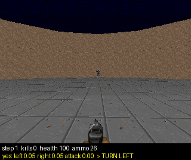

# Doom with the logit readout

vizdoom's `defend_the_center`, the scenario openjev uses: the player stands in the middle of a round
room, monsters come from all sides, and there are 26 bullets. Three moves: turn left, turn right, attack.
The game waits for each decision (one decision per 4 game tics), so speed does not affect the score.
openjev reports about 11 kills per episode. The model is a plain Qwen (0.8B or 27B), asked through the
one-pass readout. Decisions are in moth `blbci`, each experiment in `experiments/08-17`.

The recording is the best run: one question per action, 27B, 12 kills. The bar under the picture shows
how strongly the model said "yes" to each move, and which move it made.

Run it with `scripts/doom.sh` (the baseline) or `scripts/doom-experiments.sh --variant N` (all variants;
`--control random|attack` for the reference players, `--agree N` to score prompts without playing,
`--gif PATH` to record).

## What we learned

1. **The small model is worse than pressing buttons at random.** Asked "which move: A. turn left,
   B. turn right, C. attack", the 0.8B picks the first option almost every time, whatever the screen
   shows, and dies with 0 kills. Random pressing gets about 1.3, always shooting about 1.5.
2. **The big model reads the situation.** The same question with the 27B gets 5.8 kills.
3. **Rewording the scene did not help, and neither did thinking first.** Finer words, raw numbers, or
   letting the model write a one-line plan before answering changed nothing for the 0.8B: it wrote
   "aim at the Demon and fire" and then turned left. The 27B did not need a plan.
4. **One question per move works better.** Ask separately "is attack the right move right now?", "is
   turn left…?", "is turn right…?" and take the most confident yes. The 0.8B went from 0 to 2.3 kills
   (above both reference players), the 27B from 5.8 to 7.6, one episode 12. openjev scores its moves
   separately too.
5. **The small model matches words.** openjev's scene text says "a Demon left of the crosshair", and
   "left" matches "turn left". Describe the same position without that word ("at 11 o'clock", or in
   made-up symbols) and the 0.8B guesses or turns the wrong way.
6. **The big model understands clock positions, not made-up symbols.** With "at 11 o'clock" the 27B
   plays the most sensible game of all: it never turns away from a monster and never shoots at an empty
   screen. With a glossary of invented symbols it gets left and right backwards. Clock positions still
   scored only 6.2 kills, probably because "12 o'clock" is too coarse to aim with.
7. **Short radio-style text is as good as full sentences for the big model** ("Contact: Demon, 10-11
   o'clock, far." vs "You see a Demon between 10 and 11 o'clock (far)."), and worse for the small one,
   which started shooting at nothing after "No contact.".
8. **Small wording details matter to the small model.** "Is "turn right" the right move right now?"
   uses "right" three times in two meanings, and that alone blurred the answer for turn right.

## Results (kills per episode, same starting seeds)

| setup | 0.8B | 27B |
|---|---|---|
| reference: random buttons / always shoot | 1.3 / 1.5 | |
| one question, three options (openjev's scene text) | 0 | 5.8 |
| same, finer wording / raw numbers | 0 / 0 | - |
| same, with a one-line plan first | 0 | 5.4 |
| one question per move (A. Yes / B. No) | 2.3 (20 episodes) | **7.6** (max 12) |
| one question per move, plain yes/no answer | 1.65 | - |
| one question per move, clock positions | - | 6.2 |
| openjev | | ~11 |

27B rows are 5 episodes; differences under about 1.5 kills are noise.

How well the prompts separate the right move from the wrong ones, measured on 160 fixed situations
without playing (0.5 = coin toss, 1.0 = perfect), for turn left / turn right / attack:

| scene text | 0.8B | 27B |
|---|---|---|
| openjev's words ("left of the crosshair") | 0.74 / 0.80 / 0.73 | 0.90 / 0.87 / 0.71 |
| invented symbols | 0.53 / 0.50 / 0.50 | 0.31 / 0.29 / 0.75 (left and right reversed) |
| clock positions | 0.34 / 0.35 / 0.79 | 0.94 / 0.92 / 0.77 |
| clock positions, radio style | 0.39 / 0.45 / 0.79 | 0.98 / 0.89 / 0.76 |

Separating well on fixed situations predicted the game only loosely: the best-separating prompt did not
score the most kills.

## Caveats

- 5 episodes per 27B row; the 0.8B comparisons are 20 episodes.
- openjev's scene text nearly names the move ("left of" → "turn left"), so results with it partly
  measure word matching.
- "On target" in the fixed situations means the crosshair is inside the monster's outline, which is not
  the same as "a shot will kill".

## Untried

Finer aiming within clock positions ("12 o'clock, slightly left"), narrower questions combined by a vote
("is a monster on the left?", "is it in the sights?"), a trained scoring layer like openjev's, thinking
mode, real-time play.
